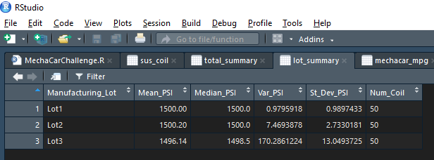
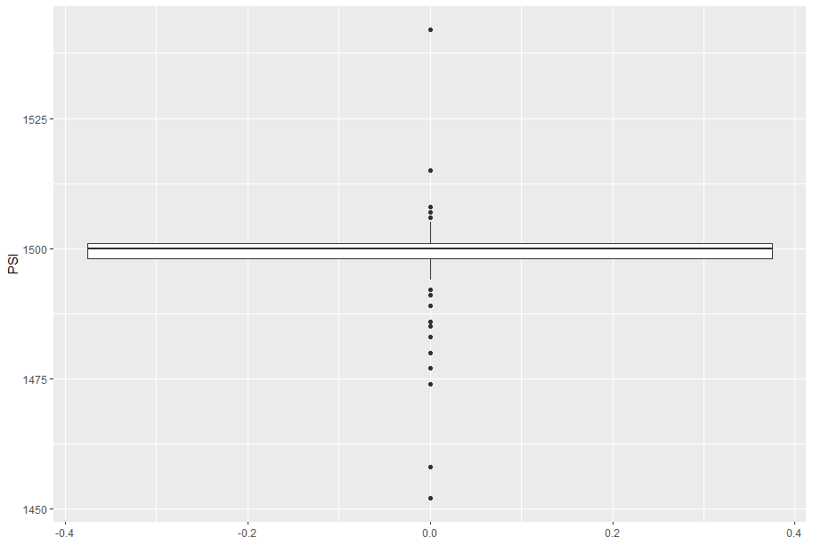
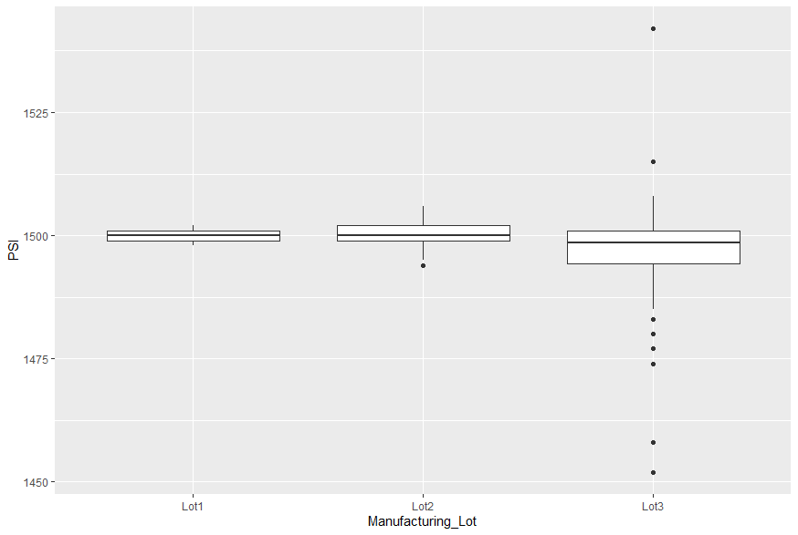

# MechaCar_Statistical_Analysis

## Linear Regression to Predict MPG
From our linear regression we can see that the only two factors which reject our null hypothesis is Ground Clearance and Vehcile length, with their values being6.5 and 9.5 respectivly. Furthermore the p-value of the whole data set is 5.21e-08 which would entail that the slop is not 0, and tht new must reject our null hypothesis and say that there is indeed something here altering the MPG. Finally we can see from our R-Value we can say with 71% certainty that all the cars will follow this model.

## Summary Statistics on Suspension Coils
when considering the requirmence that the variance of the suspension coil can not exceed 150 PSI we can see from both charts that we have obtained a varience of 62.29 PSI which is within our guidelines. However we see that when we look at our specific lots, that lot 3 sticks out as an outliner in this regaurd, with a varience of 170 PSI.

## T-Tests on Suspension Coils
### One Sample T-test
From our one sample test, we get a p-value of 0.06 which is higer then our  confidence level of 0.05. This means we must reject the null hyphothes, and say that there is a difference in the suspension coils that can not be said to be because of random chance and that further investigation is required.

## Lot T-test
For both lot 1 and 2, when we run a t-test on those specific car lots we find both times that we must reject our null. However when we look at Lot 3 we find a p-value of 0.04 and thus we must accept that the differences we are seeing their are because of random sampling.

## Study Design: MechaCar vs Competition
With the increasing prices of both catalitic converters as  well as microchip shortages and rising fuel prices, I believe that a study on car reliability as well as affordability of components would be of value moving forward. This study should take into consideration the following 
  
  1. What is the cost of producing MechCar components vs competetors? 
  2. What is the cost of manfucatoring a MechaCar vs competetors?
    
For our first two, our null would be that their is no difference between us and the competetors. However if there is a differencce we would have to see in which way does that difference swing. If we run a linear regression on these metrics, with our producst and the dependat variable and the competetors as independat, we would ideally like to see a slope of 1. however if we discovery a negative slope that should be investiaged to see why are our prices so much higher then the competetors
  
  
  3. How much supply of replacement parts for a MechaCar is avaliable?

A study randomly selecting several stock yards or warhouses that hold our replacmenet parts, then measuring the amount in stock versus the amount used over a quarter will give us an idea of how many parts we go through on a quarterly bases. our null would be that it is random, the rate at which we use parts, however our alternative hypothesis would be that their is some trend occuring here that we would again require further research into anaylizing.

  5. Which Parts have the highest rate of break-down?

For this, we can do two things. firstly, we can use our own companies research on the wear patterns of parts as well as expected life expectancy and use this as our null. We can then go to where ever our cars are brought in for maintenance and see over a year which parts they are replacing and how long until they would have to come back. We can take these numbers and compare them to the previous tests to get a realistic idea of the throughput of our parts.

  7. After how many years are MechaCars brought in for resell?

This can be a longitudanl study over severl years on how long are our cars on the road before replacing them. If we can see how long they last, we can take several measures. We can either try to make our cars last longer on the road and try to upgrade the parts, or even make certain parts more easily replacable, or plan for our cars to only be on the road for a certain time frame and make them cheaper and more easily recycled or stripped.

